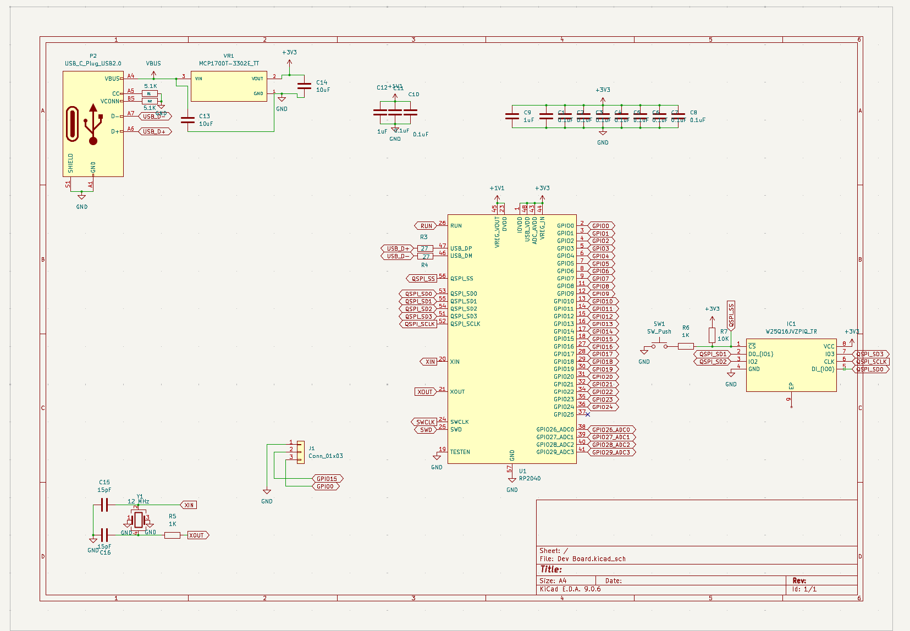
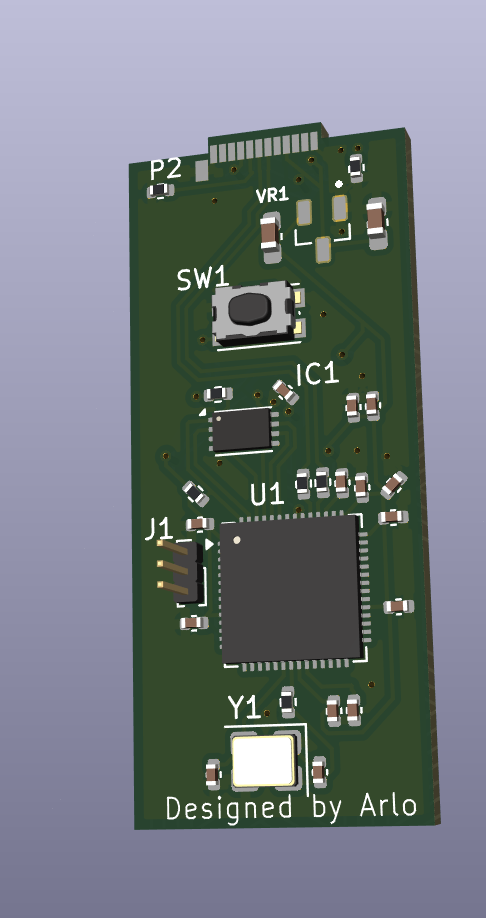

# USB-RP2040-DEVB
A RP2040 powered mini dev board. It has 2 GPIO pins, and is intended mainly for scripted HID emulation.

## Features

 - Light BOM
 - extra small size
 - male usb-c plug

## BOM

| Footprint                                   | Designation       | Quantity |   |   |
|---------------------------------------------|-------------------|----------|---|---|
| USB_C_Plug_Molex_105444                     | USB_C_Plug_USB2.0 | 1        |   |   |
| C_0402_1005Metric                           | 0.1uF             | 10       |   |   |
| Winbond_USON-8-1EP_3x2mm_P0.5mm_EP0.2x1.6mm | W25Q16JVZPIQ_TR   | 1        |   |   |
| SOT95P237X112-3N                            | MCP1700T-3302E_TT | 1        |   |   |
| SW_Push_1P1T-SH_NO_CK_KMR2xxG               | SW_Push           | 1        |   |   |
| PinHeader_1x03_P1.00mm_Vertical             | Conn_01x03        | 1        |   |   |
| Crystal_SMD_3225-4Pin_3.2x2.5mm             | 12 MHz            | 1        |   |   |
| QFN-56-1EP_7x7mm_P0.4mm_EP3.2x3.2mm         | RP2040            | 1        |   |   |
| R_0402_1005Metric                           | 10K               | 1        |   |   |
| R_0402_1005Metric                           | 1K                | 2        |   |   |
| R_0402_1005Metric                           | 27                | 2        |   |   |
| R_0402_1005Metric                           | 5.1K              | 2        |   |   |
| C_0402_1005Metric                           | 15pF              | 2        |   |   |
| C_0603_1608Metric_Pad1.08x0.95mm_HandSolder | 10uF              | 2        |   |   |
| C_0402_1005Metric                           | 1uF               | 2        |   |   |

## Images

## Pinout

The pins on the header from top to bottom are:
 - GPIO0
 - GPIO15
 - GND
 The button enters BOOTSEL